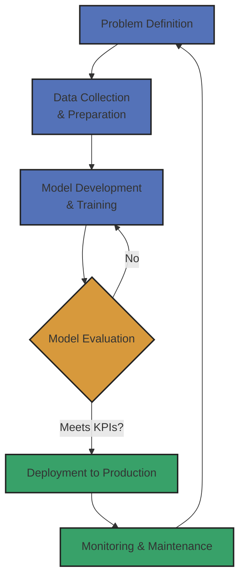
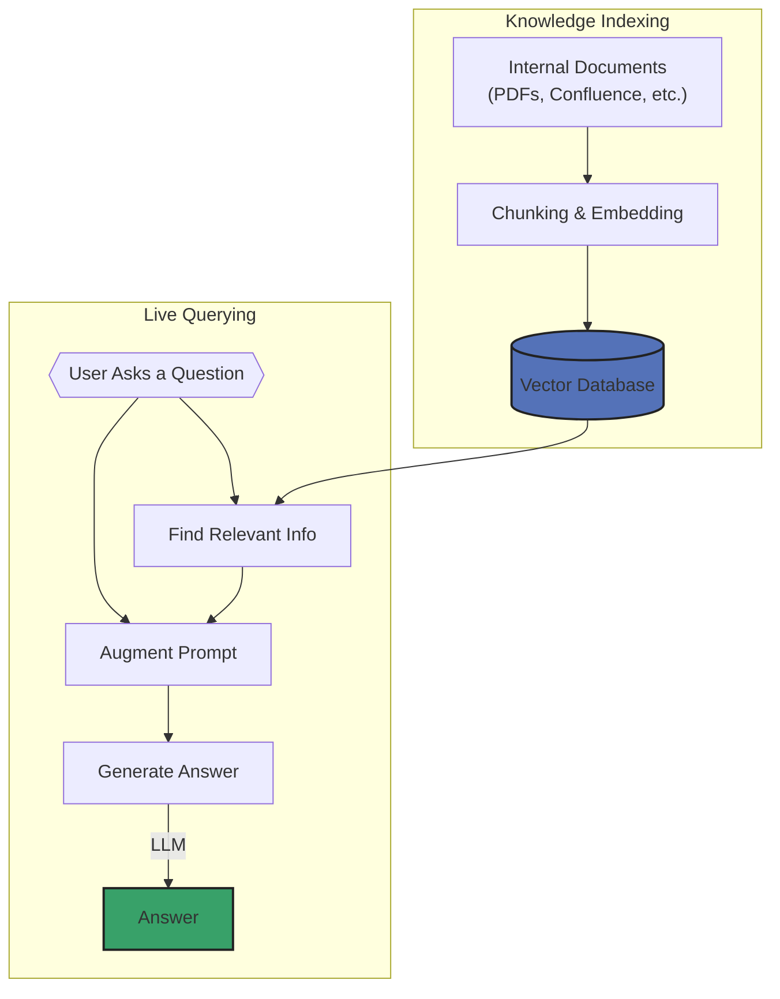
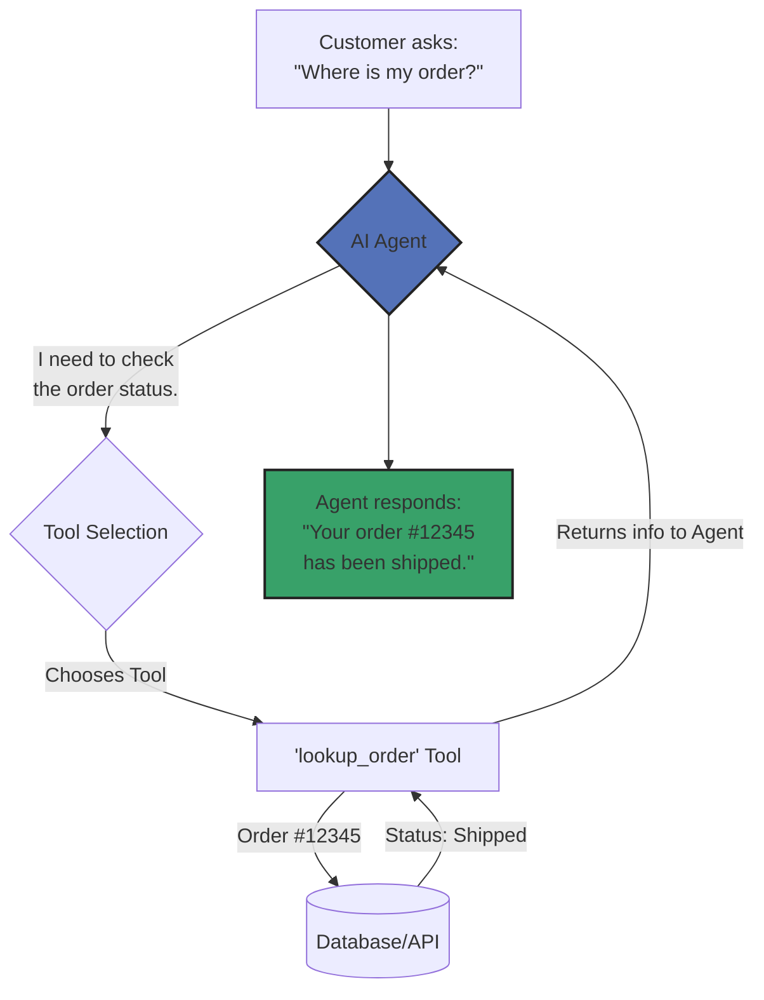
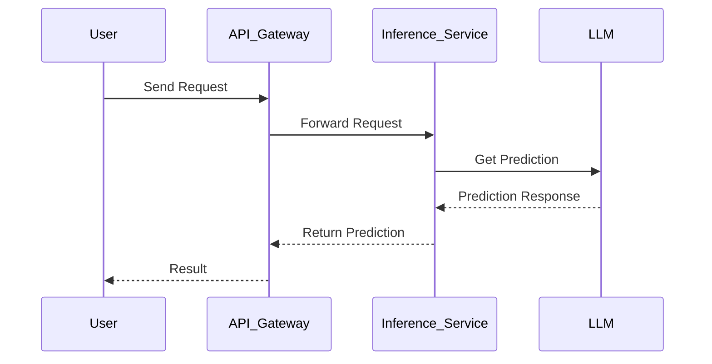
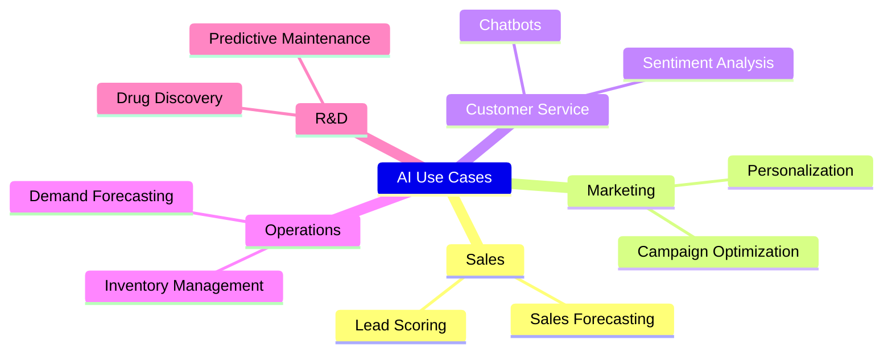

# Examples

## Flowcharts

My go-to diagram that helps to visually represent the steps of a process or workflow. They make complex processes easier to understand at a glance.

### Example 1: AI Project Workflow

Simplified overview of the end-to-end process for an AI project, from initial concept to deployment and maintenance.

### Example 2: How Our AI Answers Questions with RAG

Shows how an LLM can answer questions using specific company documents to make its responses more accurate and relevant.

### Example 3: AI Agent for Customer Support

Workflow of an AI agent that can use "tools" to perform actions, like looking up order information or processing a return.

## Sequence Diagrams

Useful for explaining the technical architecture at a high level, showing the different components and how they interact.

### Example: LLM Inference via API

Shows how a user's request flows through the system to get a prediction from an LLM. 

## Mindmaps

Helps to visually organize ideas and show relationships between them.

### Example: Potential AI Applications

This mindmap shows potential applications for AI across various departments.

