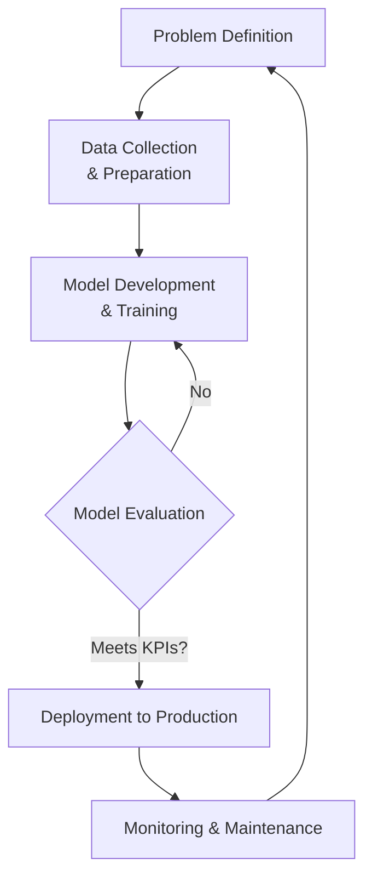
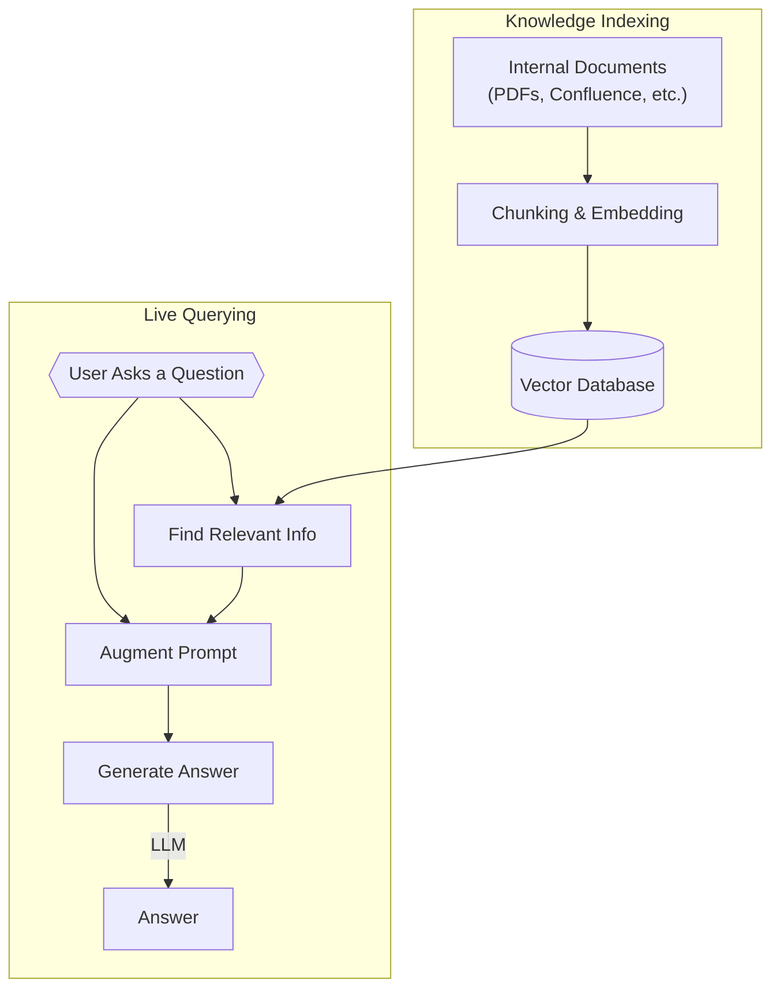
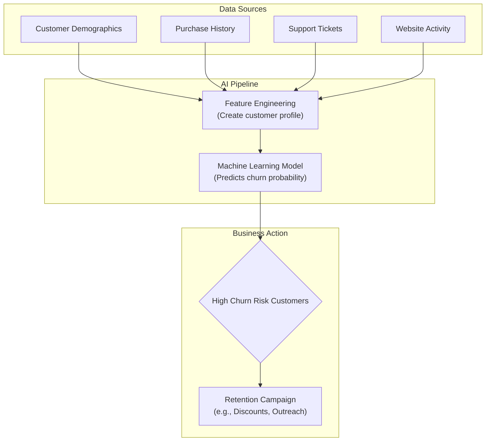
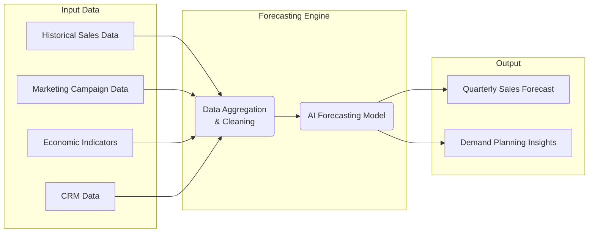
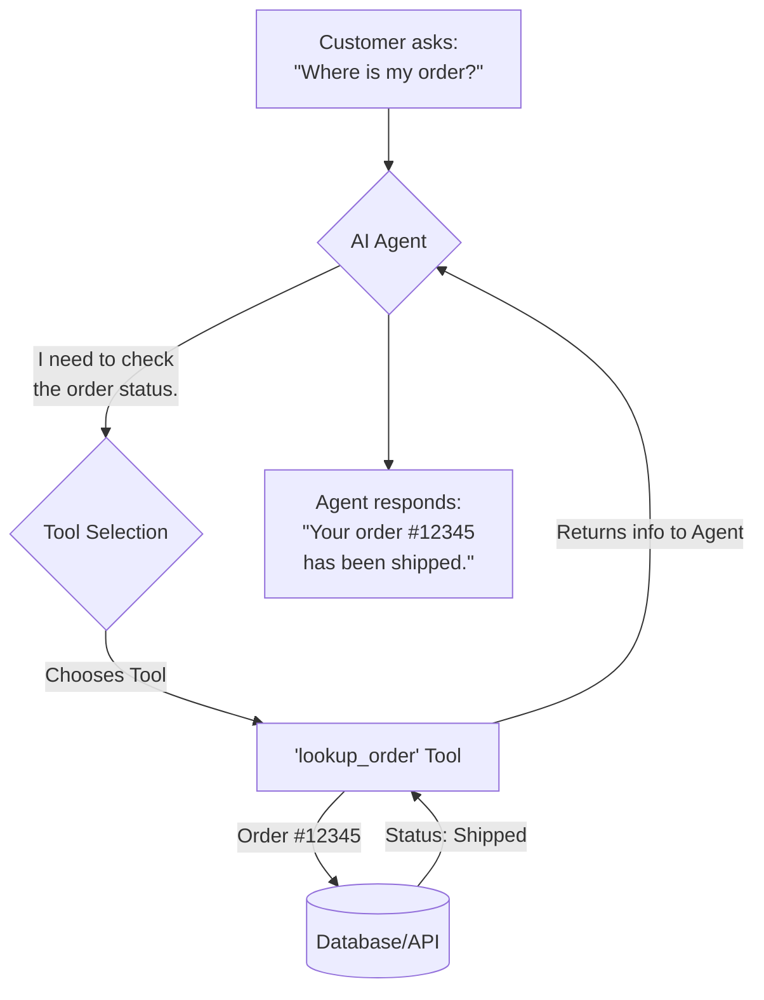

# Examples

## 1. AI Project Lifecycle

This diagram provides a simplified overview of the end-to-end process for an AI project, from initial concept to deployment and maintenance.

## 2. How Our AI Answers Questions with RAG

## 3. Predicting Customer Churn

This flowchart shows the process for a model that predicts which customers are at risk of leaving (churning). It highlights the data sources and the final business outcome.

## 4. AI-Powered Sales Forecasting

This diagram illustrates how different data streams are combined and processed by an AI model to produce a more accurate sales forecast.

## 5. AI Agent for Customer Support

This shows the workflow of an AI agent that can do more than just chat. It can use "tools" to perform actions, like looking up order information or processing a return.

